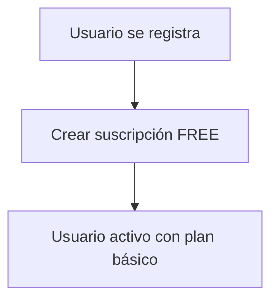
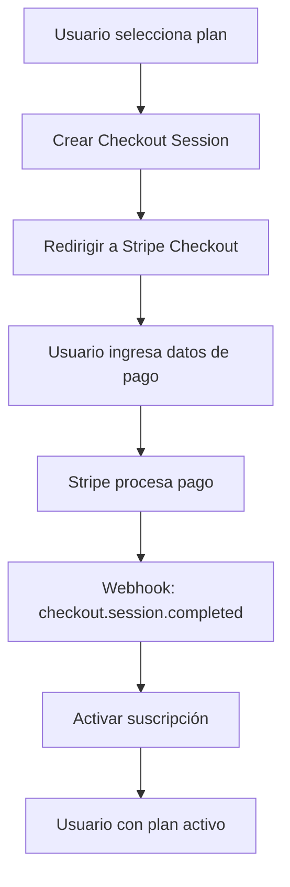
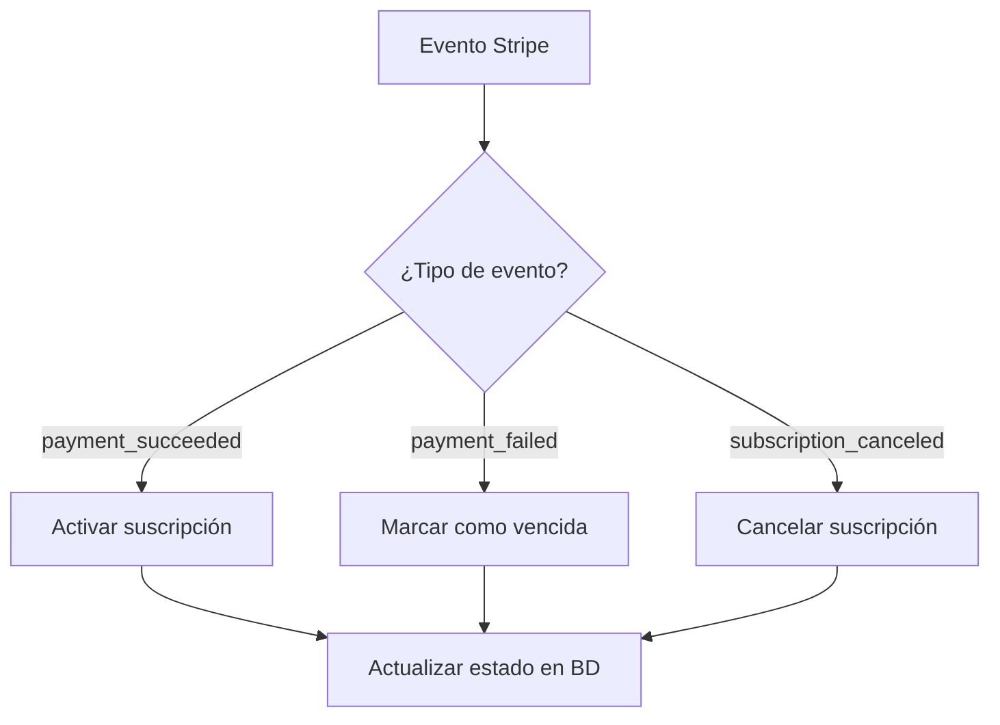

# Sistema de Suscripciones y Pagos Recurrentes - Guía Completa

## 📋 Resumen del Sistema

Este documento describe el sistema completo de suscripciones y pagos recurrentes implementado en la aplicación Prompt Generator SaaS, utilizando Stripe como pasarela de pagos.

## 🏗️ Arquitectura del Sistema

### Componentes Principales

1. **Subscription Entity** - Modelo de datos para suscripciones
2. **SubscriptionService** - Lógica de negocio para suscripciones
3. **PaymentService** - Integración con Stripe
4. **SubscriptionController** - API REST para gestión de suscripciones
5. **StripeWebhookController** - Manejo de eventos de Stripe

## 📊 Modelo de Datos

### Tabla de Suscripciones

```sql
CREATE TABLE subscriptions (
    id BIGINT AUTO_INCREMENT PRIMARY KEY,
    user_id BIGINT NOT NULL,
    plan VARCHAR(20) NOT NULL, -- FREE, PREMIUM, PRO
    status VARCHAR(20) NOT NULL, -- ACTIVE, CANCELED, PAST_DUE, UNPAID
    stripe_subscription_id VARCHAR(255) UNIQUE,
    stripe_customer_id VARCHAR(255),
    stripe_price_id VARCHAR(255),
    start_date DATE NOT NULL,
    end_date DATE,
    created_at TIMESTAMP DEFAULT CURRENT_TIMESTAMP,
    updated_at TIMESTAMP DEFAULT CURRENT_TIMESTAMP ON UPDATE CURRENT_TIMESTAMP,
    FOREIGN KEY (user_id) REFERENCES users(id)
);
```

### Campos Clave

- **stripe_subscription_id**: ID único de la suscripción en Stripe
- **stripe_customer_id**: ID del cliente en Stripe
- **stripe_price_id**: ID del precio/plan en Stripe
- **status**: Estado actual de la suscripción
- **plan**: Tipo de plan (FREE, PREMIUM, PRO)

## 💳 Planes de Suscripción

### Planes Disponibles

| Plan | Precio | Límite de Prompts | Características |
|------|--------|-------------------|-----------------|
| **Free** | $0/mes | 10 prompts | Acceso básico |
| **Premium** | $9.99/mes | 100 prompts | Prompts personalizados |
| **Pro** | $19.99/mes | Ilimitado | Soporte prioritario |

### Configuración de Planes

```java
public List<SubscriptionPlan> getAvailablePlans() {
    return Arrays.asList(
        createPlan("free", "Free", "Basic access with limited prompts", 
                  null, 0.0, "USD", "monthly", 10, false, false),
        createPlan("premium", "Premium", "Enhanced features with more prompts", 
                  "price_premium_monthly", 9.99, "USD", "monthly", 100, true, false),
        createPlan("pro", "Pro", "Unlimited access with priority support", 
                  "price_pro_monthly", 19.99, "USD", "monthly", -1, true, true)
    );
}
```

## 🔄 Flujo de Suscripción

### 1. Registro de Usuario


### 2. Proceso de Pago


### 3. Gestión de Suscripciones


## 🛠️ API Endpoints

### Gestión de Planes

#### Obtener Planes Disponibles
```http
GET /api/subscriptions/plans
Authorization: Bearer <jwt_token>
```

**Respuesta:**
```json
[
  {
    "id": "free",
    "name": "Free",
    "description": "Basic access with limited prompts",
    "price": 0.0,
    "currency": "USD",
    "interval": "monthly",
    "promptLimit": 10,
    "customPrompts": false,
    "prioritySupport": false
  },
  {
    "id": "premium",
    "name": "Premium",
    "description": "Enhanced features with more prompts",
    "stripePriceId": "price_premium_monthly",
    "price": 9.99,
    "currency": "USD",
    "interval": "monthly",
    "promptLimit": 100,
    "customPrompts": true,
    "prioritySupport": false
  }
]
```

### Gestión de Suscripciones

#### Obtener Mi Suscripción
```http
GET /api/subscriptions/my-subscription
Authorization: Bearer <jwt_token>
```

**Respuesta:**
```json
{
  "subscription": {
    "id": 1,
    "plan": "PREMIUM",
    "status": "ACTIVE",
    "startDate": "2024-01-15",
    "stripeSubscriptionId": "sub_1234567890"
  },
  "currentPlan": {
    "id": "premium",
    "name": "Premium",
    "price": 9.99
  },
  "isActive": true,
  "canCreatePrompt": true,
  "promptLimit": 100,
  "hasCustomPrompts": true,
  "hasPrioritySupport": false
}
```

#### Crear Sesión de Checkout
```http
POST /api/subscriptions/create-checkout-session
Authorization: Bearer <jwt_token>
Content-Type: application/json

{
  "priceId": "price_premium_monthly",
  "successUrl": "https://yourapp.com/success",
  "cancelUrl": "https://yourapp.com/cancel"
}
```

**Respuesta:**
```json
{
  "sessionId": "cs_1234567890",
  "sessionUrl": "https://checkout.stripe.com/pay/cs_1234567890",
  "message": "Checkout session created successfully"
}
```

#### Actualizar Suscripción
```http
POST /api/subscriptions/upgrade
Authorization: Bearer <jwt_token>
Content-Type: application/x-www-form-urlencoded

newPriceId=price_pro_monthly&successUrl=https://yourapp.com/success&cancelUrl=https://yourapp.com/cancel
```

#### Cancelar Suscripción
```http
POST /api/subscriptions/cancel
Authorization: Bearer <jwt_token>
```

### Verificación de Funcionalidades

#### Verificar Si Puede Crear Prompt
```http
GET /api/subscriptions/features
Authorization: Bearer <jwt_token>
```

**Respuesta:**
```json
{
  "canCreatePrompt": true,
  "promptLimit": 100,
  "hasCustomPrompts": true,
  "hasPrioritySupport": false,
  "isActive": true
}
```

#### Verificar Elegibilidad de Upgrade
```http
GET /api/subscriptions/can-upgrade?targetPlan=pro
Authorization: Bearer <jwt_token>
```

**Respuesta:**
```json
{
  "canUpgrade": true,
  "targetPlan": "pro"
}
```

## 🔧 Configuración de Stripe

### Variables de Entorno Requeridas

```bash
# Stripe Configuration
STRIPE_SECRET_KEY=sk_test_xxxxxxxxxxxxxxxxxxxxxx
STRIPE_WEBHOOK_SECRET=whsec_xxxxxxxxxxxxxxxxxxxxxx
STRIPE_PUBLISHABLE_KEY=pk_test_xxxxxxxxxxxxxxxxxxxxxx
```

### Configuración en application.yml

```yaml
stripe:
  secret-key: ${STRIPE_SECRET_KEY:sk_test_xxxxxxxxxxxxxxxxxxxxxx}
  webhook-secret: ${STRIPE_WEBHOOK_SECRET:whsec_xxxxxxxxxxxxxxxxxxxxxx}
  publishable-key: ${STRIPE_PUBLISHABLE_KEY:pk_test_xxxxxxxxxxxxxxxxxxxxxx}
```

## 🔔 Webhooks de Stripe

### Endpoint de Webhook
```http
POST /api/webhooks/stripe
Stripe-Signature: <signature>
Content-Type: application/json

{
  "id": "evt_1234567890",
  "type": "checkout.session.completed",
  "data": {
    "object": {
      "id": "cs_1234567890",
      "subscription": "sub_1234567890",
      "customer": "cus_1234567890"
    }
  }
}
```

### Eventos Manejados

1. **checkout.session.completed** - Sesión de checkout completada
2. **customer.subscription.created** - Suscripción creada
3. **customer.subscription.updated** - Suscripción actualizada
4. **customer.subscription.deleted** - Suscripción cancelada
5. **invoice.payment_succeeded** - Pago exitoso
6. **invoice.payment_failed** - Pago fallido

### Manejo de Eventos

```java
@PostMapping("/stripe")
public ResponseEntity<String> handleStripeEvent(
        @RequestBody String payload,
        @RequestHeader("Stripe-Signature") String sigHeader) {
    
    Event event = Webhook.constructEvent(payload, sigHeader, endpointSecret);
    
    switch (event.getType()) {
        case "checkout.session.completed":
            handleCheckoutSessionCompleted(event);
            break;
        case "customer.subscription.created":
            handleSubscriptionCreated(event);
            break;
        case "invoice.payment_succeeded":
            handleInvoicePaymentSucceeded(event);
            break;
        case "invoice.payment_failed":
            handleInvoicePaymentFailed(event);
            break;
    }
    
    return ResponseEntity.ok("Webhook processed successfully");
}
```

## 🔄 Gestión de Estados

### Estados de Suscripción

| Estado | Descripción | Acciones |
|--------|-------------|----------|
| **ACTIVE** | Suscripción activa y pagada | Usuario puede usar todas las funciones |
| **CANCELED** | Suscripción cancelada | Usuario mantiene acceso hasta fin de período |
| **PAST_DUE** | Pago vencido | Usuario tiene acceso limitado |
| **UNPAID** | Pago fallido | Usuario sin acceso a funciones premium |

### Transiciones de Estado

```java
// Activar suscripción
subscription.setStatus("ACTIVE");
subscription.setEndDate(null);

// Cancelar suscripción
subscription.setStatus("CANCELED");
subscription.setEndDate(LocalDate.now());

// Marcar como vencida
subscription.setStatus("PAST_DUE");
```

## 🔐 Seguridad y Validaciones

### Validaciones de Entrada

```java
@NotBlank(message = "Price ID is required")
@Pattern(regexp = "^price_[a-zA-Z0-9_]+$", message = "Invalid price ID format")
private String priceId;

@NotBlank(message = "Success URL is required")
@Pattern(regexp = "^https?://[\\w\\d\\-._~:/?#\\[\\]@!$&'()*+,;=%]+$", 
         message = "Invalid success URL format")
private String successUrl;
```

### Verificación de Webhooks

```java
Event event = Webhook.constructEvent(payload, sigHeader, endpointSecret);
```

### Control de Acceso

```java
@PreAuthorize("hasAnyRole('USER', 'ADMIN')")
public ResponseEntity<?> getMySubscription(Authentication authentication) {
    // Solo usuarios autenticados pueden acceder
}
```

## 📈 Monitoreo y Logging

### Logs de Seguridad

```java
log.info("Stripe checkout session created: {} for user: {}", session.getId(), userId);
log.warn("Rate limit exceeded for IP: {} on endpoint: {}", clientIp, request.getRequestURI());
log.error("Payment error: {}", ex.getMessage());
```

### Métricas a Monitorear

1. **Tasa de Conversión**: Usuarios que completan el pago
2. **Tasa de Cancelación**: Usuarios que cancelan suscripciones
3. **Fallos de Pago**: Intentos de pago fallidos
4. **Upgrades/Downgrades**: Cambios de plan

## 🚀 Despliegue y Configuración

### Configuración de Producción

1. **Configurar Stripe Live Keys**:
   ```bash
   STRIPE_SECRET_KEY=sk_live_xxxxxxxxxxxxxxxxxxxxxx
   STRIPE_WEBHOOK_SECRET=whsec_xxxxxxxxxxxxxxxxxxxxxx
   STRIPE_PUBLISHABLE_KEY=pk_live_xxxxxxxxxxxxxxxxxxxxxx
   ```

2. **Configurar Webhook en Stripe Dashboard**:
   - URL: `https://yourapp.com/api/webhooks/stripe`
   - Eventos: `checkout.session.completed`, `customer.subscription.*`, `invoice.payment_*`

3. **Configurar Planes en Stripe**:
   - Crear productos y precios para cada plan
   - Configurar intervalos de facturación
   - Configurar límites de uso

### Verificación Post-Despliegue

1. **Probar Webhooks**:
   ```bash
   curl -X POST https://yourapp.com/api/webhooks/stripe \
     -H "Stripe-Signature: whsec_..." \
     -H "Content-Type: application/json" \
     -d '{"test": "webhook"}'
   ```

2. **Verificar Configuración**:
   ```bash
   curl -X GET https://yourapp.com/api/subscriptions/plans \
     -H "Authorization: Bearer <jwt_token>"
   ```

## 🔧 Mantenimiento

### Tareas Programadas

1. **Procesar Suscripciones Expiradas**:
   ```java
   @Scheduled(cron = "0 0 1 * * ?") // Diario a la 1 AM
   public void processExpiredSubscriptions() {
       List<Subscription> expired = subscriptionService.getExpiredSubscriptions();
       for (Subscription subscription : expired) {
           subscription.setStatus("EXPIRED");
           subscriptionRepository.save(subscription);
       }
   }
   ```

2. **Limpieza de Datos**:
   - Eliminar suscripciones canceladas antiguas
   - Limpiar logs de webhooks antiguos
   - Optimizar índices de base de datos

### Backup y Recuperación

1. **Backup de Base de Datos**:
   ```bash
   mysqldump -u root -p prompt_saas > backup_$(date +%Y%m%d).sql
   ```

2. **Backup de Configuración**:
   - Guardar variables de entorno
   - Documentar configuración de Stripe
   - Mantener copias de seguridad de webhooks

## 🐛 Troubleshooting

### Problemas Comunes

1. **Webhook No Recibido**:
   - Verificar URL del webhook en Stripe Dashboard
   - Verificar firma del webhook
   - Revisar logs de la aplicación

2. **Suscripción No Activada**:
   - Verificar que el webhook se procesó correctamente
   - Revisar logs de Stripe
   - Verificar configuración de customer ID

3. **Pagos Fallidos**:
   - Revisar configuración de tarjetas de prueba
   - Verificar límites de rate limiting
   - Revisar logs de errores de Stripe

### Comandos de Diagnóstico

```bash
# Verificar logs de la aplicación
tail -f logs/application.log | grep -i "stripe\|payment\|subscription"

# Verificar estado de la base de datos
mysql -u root -p -e "SELECT * FROM subscriptions WHERE status = 'ACTIVE';"

# Verificar configuración de Stripe
curl -X GET https://api.stripe.com/v1/account \
  -H "Authorization: Bearer sk_test_..."
```

## 📚 Recursos Adicionales

### Documentación de Stripe
- [Stripe API Documentation](https://stripe.com/docs/api)
- [Stripe Webhooks Guide](https://stripe.com/docs/webhooks)
- [Stripe Checkout Documentation](https://stripe.com/docs/payments/checkout)

### Mejores Prácticas
- [OWASP Payment Security](https://owasp.org/www-project-payment-security-standards/)
- [PCI DSS Compliance](https://www.pcisecuritystandards.org/)
- [Stripe Security Best Practices](https://stripe.com/docs/security)

### Herramientas de Testing
- [Stripe CLI](https://stripe.com/docs/stripe-cli)
- [Stripe Test Cards](https://stripe.com/docs/testing#cards)
- [Webhook Testing](https://stripe.com/docs/webhooks/test)

---

Este sistema proporciona una base sólida para manejar suscripciones y pagos recurrentes de manera segura y escalable. Asegúrate de seguir las mejores prácticas de seguridad y mantener el sistema actualizado regularmente.
